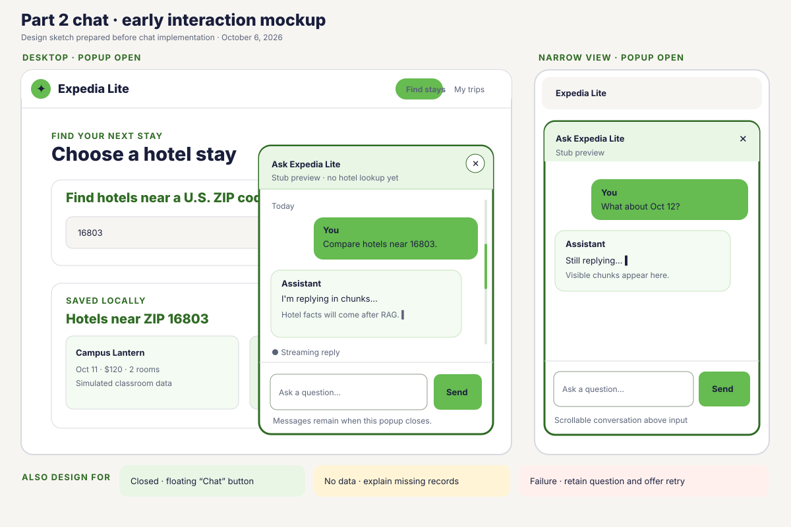
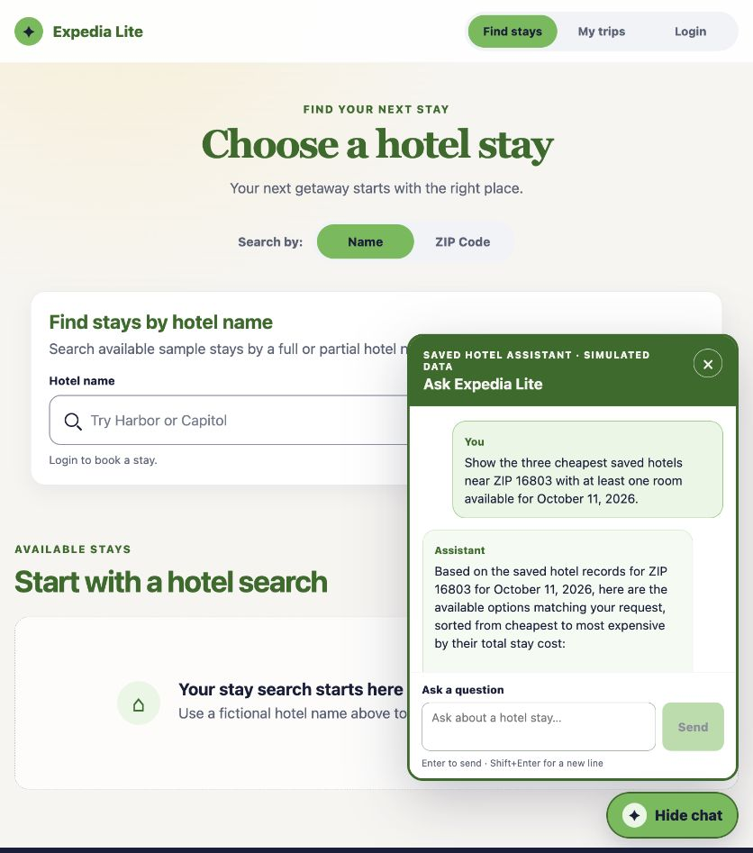
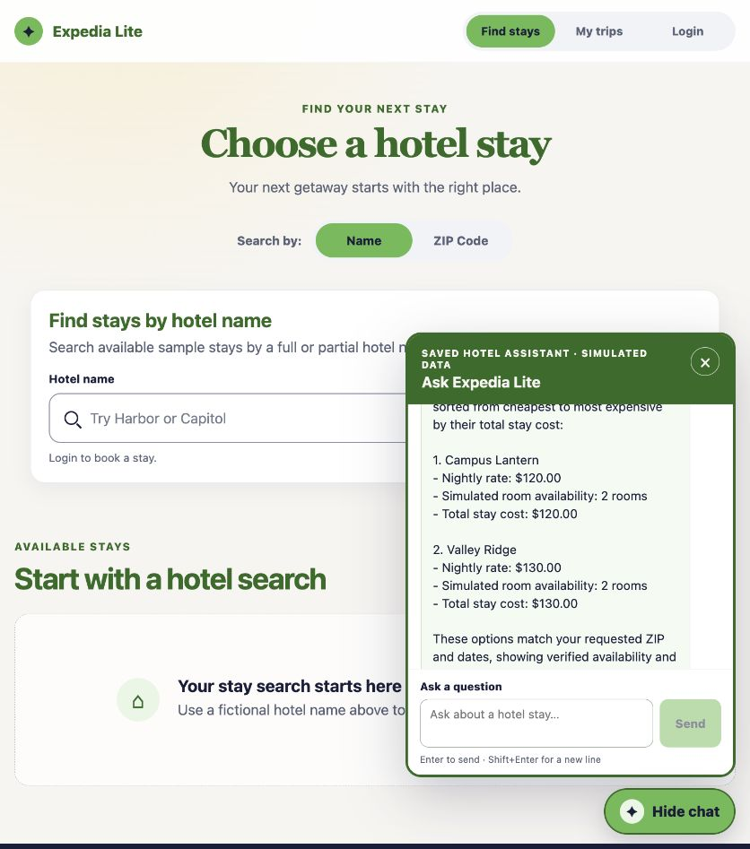
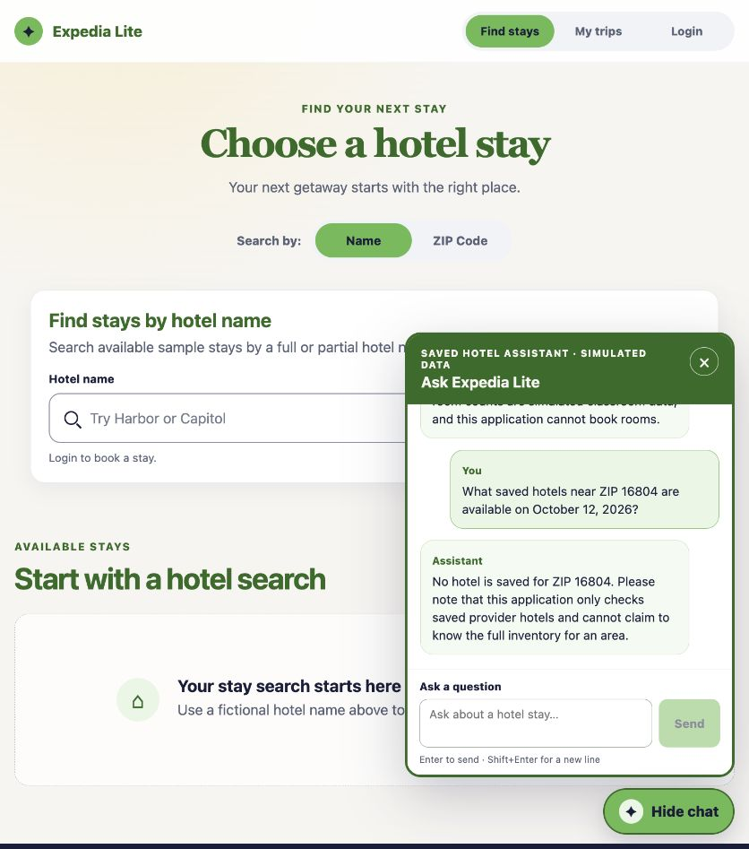
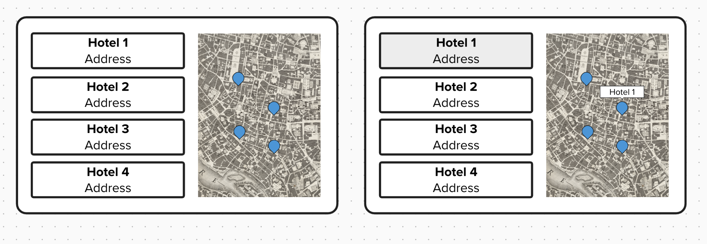

# Expedia Lite — Assignment 2, Part 2

## Project access

Repository: [Expedia Lite](https://github.com/jclee2044/expedia-lite).
Part 2 is being prepared on `rag_integration`. **Assessed Part 2 commit:
TODO after final review and push.** The current baseline commit
[`d8edae8`](https://github.com/jclee2044/expedia-lite/commit/d8edae8077373528cfd4e690c212c4d0e9b1c9fc)
predates the Part 2 work and must not be mistaken for its assessed commit.

Use Python 3.12 and a supported Node.js version. From the project root:

```bash
python3.12 -m venv backend/.venv
backend/.venv/bin/python -m pip install -r backend/requirements.txt
cd frontend
npm ci
```

Start the backend from the project root with `backend/.venv/bin/python -m uvicorn backend.app.main:app --reload`. In another terminal, run `npm run dev` from `frontend/`, then open `http://127.0.0.1:5173`. See the [README](README.md) for configuration details.

For a reproducible Part 2 demonstration, put `GEMINI_API_KEY` in the ignored
project-root `.env`, then run the [fixture preparation command](README.md#reproduce-the-synthetic-rag-demonstration)
to create a **new** ignored SQLite database. Start its FastAPI instance on
8001 and Vite with `EXPEDIA_API_TARGET=http://127.0.0.1:8001` on 5174 as
documented there. The fixture script refuses to overwrite an existing
database. It does not change the default runtime database or course CSVs.

## Part 2 research and design decisions

The [early Part 2 mockup](docs/assignment2-part2-chat-mockup.svg) was drawn
before the chat source changes. Its [preflight notes](docs/assignment2-part2-preflight.md)
record a bottom-right popup, narrow layout, streaming, empty, and failure
states. I kept the existing green palette and made the popup non-modal so a
traveler can continue using search while it is open. The [W3C modal dialog
pattern](https://www.w3.org/WAI/ARIA/apg/patterns/dialog-modal/) warns against
marking a popup modal when the page behind it remains interactive. [MDN's log
role reference](https://developer.mozilla.org/en-US/docs/Web/Accessibility/ARIA/Reference/Roles/log_role)
informed the sequential conversation region and restrained status messages.

Google's [Gemini generate-content API](https://ai.google.dev/api/generate-content)
documents a streaming endpoint. I selected the existing project-owned `httpx`
dependency to call it from FastAPI and kept the key out of Vue. SQLite's
[authorizer documentation](https://www.sqlite.org/c3ref/set_authorizer.html)
informed the allowlist used when compiling model-proposed SQL. The model
receives schema instructions and proposes a query; the backend validates
that proposal and independently verifies every returned hotel's ZIP, dates,
room counts, and integer-cent total. The model cannot write hotel data or
book a room.



## Part 2 implementation and traced demonstration

The flow is **question → Gemini SQL proposal → checked read-only SQLite
retrieval → second Gemini request with bounded checked rows → streamed
answer**. The saved-hotel, ZIP-association, and demo-night tables join on
`hotel_id`. The model's query returns candidate IDs only; trusted backend
queries check ZIP membership, complete nightly coverage, positive rooms on
each requested night, and totals with checkout excluded. The
[versioned prompt](prompts/hotel-assistant.md), [trace](docs/rag-context.md),
and [JSON fixture](docs/part2-rag-fixture.json) show the exact contract and
synthetic data. Conversation messages and proposal, execution, result, and
error stages are stored with IDs and UTC timestamps in SQLite.

On October 6, 2026, a **live Gemini two-call** question in the freshly
generated synthetic demonstration database asked for the three cheapest
available saved hotels near ZIP 16803 on October 11. The saved proposal
joined the three approved tables and bound `postcode=16803`,
`check_in=2026-10-11`, and `check_out=2026-10-12`. Direct SQLite rows showed
Nittany Budget at 10000 cents with zero rooms, Campus Lantern at 12000 cents
with two rooms, and Valley Ridge at 13000 cents with two rooms. The checked
result excluded Budget; the streamed answer named Campus at **$120** and
Valley at **$130**, in that order, and labeled availability simulated. The
saved conversation ID is `3194b644-e677-4461-89ec-7bb08c7c4a84` in the
ignored `backend/db/part2-submission-demo.sqlite3` database. The
[detailed trace](docs/rag-context.md) records SQL, result rows, and stages.





The earlier isolated preview conversation also demonstrated a same-ZIP/date
follow-up, an October 12 three-hotel comparison, changed ZIP/date checks,
failure trace, and history restoration after a backend restart. Those calls
used **live Gemini with synthetic SQLite records**; the disallowed-SQL and
provider-failure checks used temporary databases or labeled mocks.

| Input or action | Expected | Observed |
| --- | --- | --- |
| ZIP 16803, October 11 | Exclude the zero-room hotel; sort available saved stays | Campus $120, Valley $130; direct two-JOIN rows and saved `result` stage agreed |
| ZIP 16804, October 12 | Explain absence without inventing hotels | Zero saved ZIP associations and zero matches; live answer said no hotel is saved for that ZIP |
| ZIP 16803, October 15 | Treat missing nights as unknown availability | Three saved ZIP candidates, zero night rows, three incomplete; live answer said availability cannot be verified |
| Proposed `UPDATE` on a temporary database | Reject it; preserve the hotel row | Rejected before execution; `Proof Hotel` remained `Proof Hotel`; no foreign-key violations |
| Refresh and restart the task-owned backend | Restore conversation and trace | Same messages returned after page reload and backend restart; failed turns had no successful assistant message |
| Regression and browser console | Existing app behavior remains green; no application errors | 146 backend tests, 26 frontend tests, Oxlint, ESLint, and production build passed; browser warning/error log was empty |




The [fixed fixture](docs/part2-rag-fixture.json) and
`backend/.venv/bin/python -m backend.prepare_rag_demo backend/db/part2-demo.sqlite3`
reproduce the data without overwriting the default database. Run
`backend/.venv/bin/python -m pytest backend/tests/test_retrieval.py -q` to
repeat the blocked SQL cases against temporary databases. The [Turn 5
checkpoint](docs/assignment2-part2-stage5.md) lists all commands, exact
observations, corrections, and verification limits.

## Part 2 demo, AI disclosure, and remaining submission items

The screenshots above document automated browser interaction. **A Part 2
screen-recorded demo video and an instructor-accessible link are still
required before submission.** The earlier Part 1 recording below does not
demonstrate the RAG flow. The demo should show the saved question, generated
SQL, direct two-JOIN rows, checked result, streamed answer, changed ZIP/date,
rejected temporary query, and history after refresh or restart. Record only
synthetic data and keep the ignored `.env` and keys off-screen.

I used **Codex (GPT-6)** to plan and implement the local-storage foundation,
chat UI, retrieval guard, tests, browser checks, and this evidence. The user
directed: “summarize progress on assignment 2.2 and plan + execute turn 3,”
“make sure you do the autoloop after each run. automated browser testing,”
and “go ahead and continue to turn 4.” These prompts led to the
[checked retrieval controller](backend/controllers/retrieval.py),
[two-call chat controller](backend/controllers/rag_chat.py), and
[browser chat component](frontend/src/components/ChatPopup.vue).
**Gemini 3.5 Flash-Lite** was the runtime model for the SQL proposal and
grounded answer; it did not receive a database handle. The [prompt file](prompts/hotel-assistant.md)
and trace versions identify the instructions used. During verification,
ESLint found a missing Node `process` import in the Vite proxy configuration;
that import was added. Browser review found that a failed reply left a
streaming placeholder; the UI was changed to show that no answer was saved
and offer Edit question for missing context. Both fixes were retested.

Limitations: the saved hotels, rates, and room counts are synthetic and do
not represent live provider inventory or bookable rooms. The parser accepts
one five-digit ZIP and one or two ISO or full-month dates; other forms may
need clarification. The current local 5173 frontend still proxies to an
older preexisting backend on 8000; the isolated 5174/8001 preview is the
verified Part 2 demonstration. A clean startup using the source and commands
above loads the current routes. **Student review, an assessed commit/push,
and the Part 2 recording/link remain pending.**

## Earlier Part 1 research notes and evidence

I looked at [Trivago](https://www.trivago.com/), [Expedia](https://www.expedia.com/Hotels), and [Booking.com](https://www.booking.com/). My [Trivago screenshot](docs/mockups/assignment-1/trivago.png) shows the idea I liked most: hotel cards on the left and a map on the right. I also liked seeing a picture next to each hotel name.

The Trivago screen felt clunky and overcrowded to me. Not all the hotel names appeared on screen, and the prices on the map jumped up and down, which was distracting and confusing. I kept the cards-left/map-right idea but made the cards simpler and easier to read.

I also consulted the [Geoapify geocoding](https://apidocs.geoapify.com/docs/geocoding/) and [Places](https://apidocs.geoapify.com/docs/places/) documentation and the [Leaflet quick start](https://leafletjs.com/examples/quick-start/) while building the ZIP search and map.

## Early mockup



The [mockup](docs/mockups/a2.1-mockups.png) was drawn before implementation. It shows hotel cards on the left and pins on the right, with a name callout. The final interface adds ZIP search and linked selection. I tried an indigo color, did not like it, then liked the [green preview](docs/mockups/assignment-1/green-brand-preview.jpg) and used green instead. A separate [layout sketch](docs/assignment2-part1-mockup.svg) was drawn during implementation.

I also tried putting a picture on the left side of each card, like the Trivago example. Most Geoapify results did not have an image, so I dropped that idea rather than showing an ugly placeholder icon.

## Screen-recorded demo video

[Expedia Lite A2.1 Demo.mov](<Expedia Lite A2.1 Demo.mov>)
You can also access it [here](https://drive.google.com/file/d/1APcj5KUJjuMnFSSOqp4xS9IsRatzvbxZ/view?usp=drive_link).

## Verification record

On September 29, 2026, the automated checks passed: **118 backend tests** and **16 frontend tests**. The live ZIP searches below were observed on September 29, 2026.

Test 1: When the user searches ZIP `16802`:

- Expected: The app shows hotel results near State College, PA, in the list and on the map.
- Actual: The app resolved `16802` to State College and displayed 21 places, including the Nittany Lion Inn and the Penn Stater, with matching map markers.

Test 2: When the user searches ZIP `17042`:

- Expected: The app shows hotel results in the Lebanon, PA, area.
- Actual: The app resolved `17042` to North Cornwall Township and displayed two places: Days Inn - Lebanon / Hershey in Lebanon and Fairfield Inn & Suites in North Cornwall Township.

Test 3: When the user clicks the hotel card for the Nittany Lion Inn:

- Expected: Its associated map marker is highlighted.
- Actual: The card and its matching marker both showed the selected state after the card was clicked.

Test 4: When the user clicks the map marker for the Penn Stater:

- Expected: The associated hotel card is selected.
- Actual: Activating the marker with the keyboard selected and scrolled to the Penn Stater card.

Test 5: When the user submits ZIP `000000`:

- Expected: The app shows an error about the ZIP code instead of running a hotel search.
- Actual: The app showed “Enter exactly five digits for a U.S. ZIP code.” No hotel results appeared.

Test 6: When the user enters letters such as `abcde` for the ZIP code and submits the form:

- Expected: The interface does not accept letters as a valid ZIP code.
- Actual: The form rejects letters on submission with “Enter exactly five digits for a U.S. ZIP code.”

## AI disclosure and evidence log

I used **Codex with GPT-6 Sol** for the implementation, visual previews, and verification. These prompt excerpts show how I directed the work.

The setup prompt led to the [Geoapify controller](backend/controllers/places.py) and [ZIP request code](frontend/src/api/locations.js):

```vbnet
identify key dependencies and initial setup for PART 1 of assignment 2. Must be able to look up by zip code and find hotels in that area.
develop a step by step plan to get the dependencies setup, following best swe principles and finding the minimal solution.
```

The selection prompt shaped the [list](frontend/src/components/NearbyHotelsPanel.vue) and [map](frontend/src/components/NearbyHotelsMap.vue):

```vbnet
currently clicking a hotel on the left side selects the pin on the right. next step, we need the opposite to be true as well. clicking the pin on the right should select the hotel on the left
```

The hover prompt added the name callout in the [map component](frontend/src/components/NearbyHotelsMap.vue):

```css
on the map, when i hover over a pin, it should have a callout directly above the pin showing the name of the hotel
```

I annotated the left side of the card and asked for pictures, then revised that approach when most results had no image. The [cards](frontend/src/components/NearbyHotelsPanel.vue) no longer depend on hotel pictures:

```sql
add the pull for the hotel image and display it on the left side of the card, with text on the right, for each card.
implement only the backend first. once thats been validated then add the frontend
```

This indigo prompt changed [main.css](frontend/src/assets/main.css). I disliked the result, previewed green, and chose green instead:

```css
this is now the brand color of the app. change the main headings (e.g., "Choose a hotel stay", "Hotels near ZIP #####", etc), icon, pill background colors
background of the hotel icons should be a lighter version of this
```
