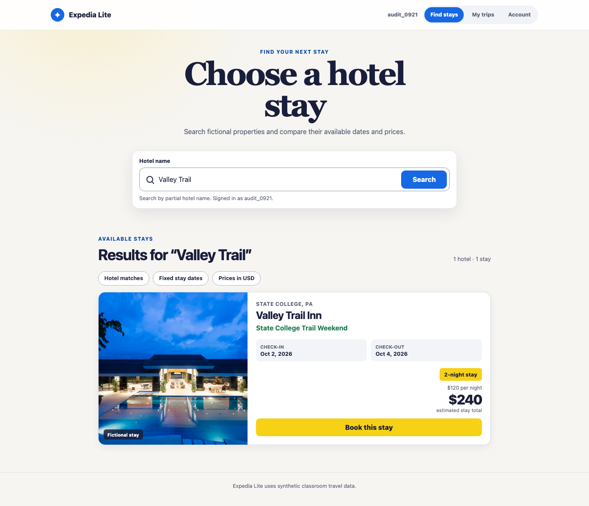
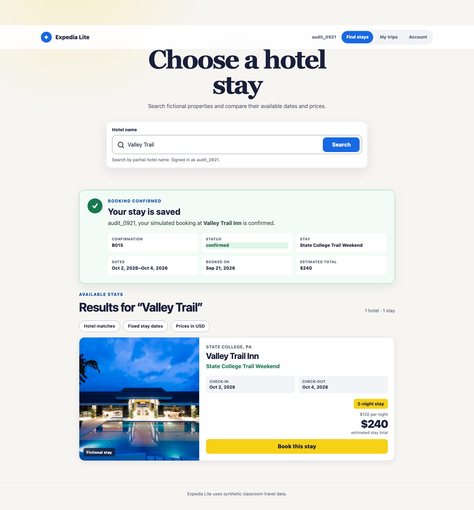
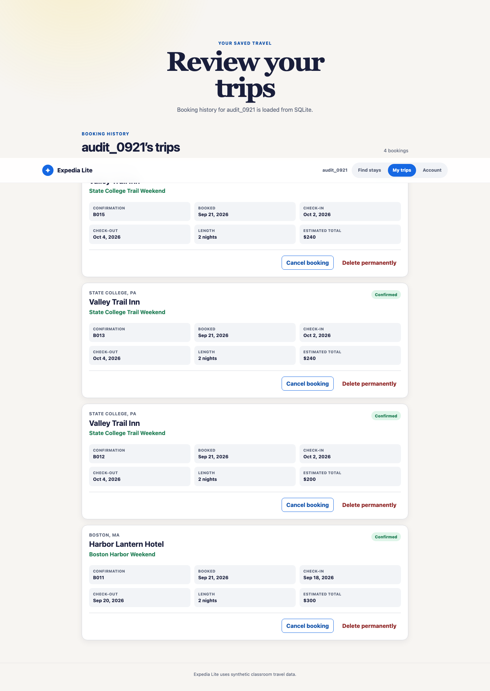
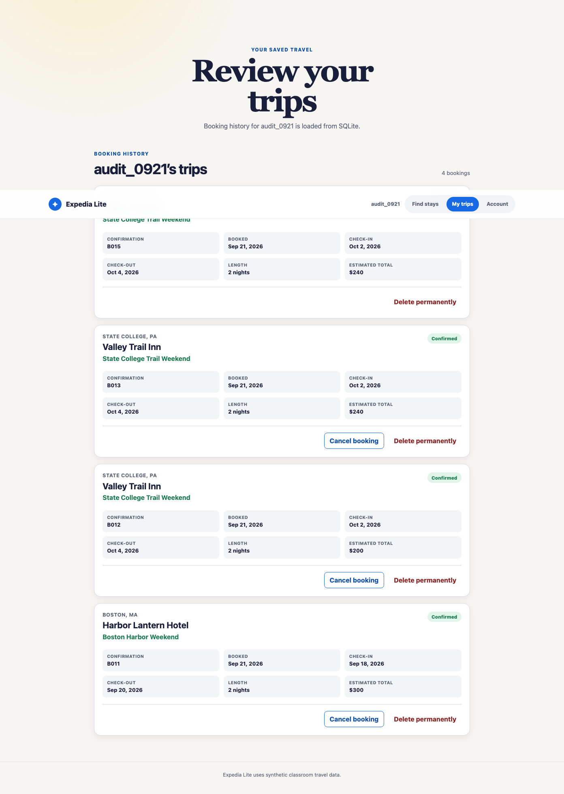
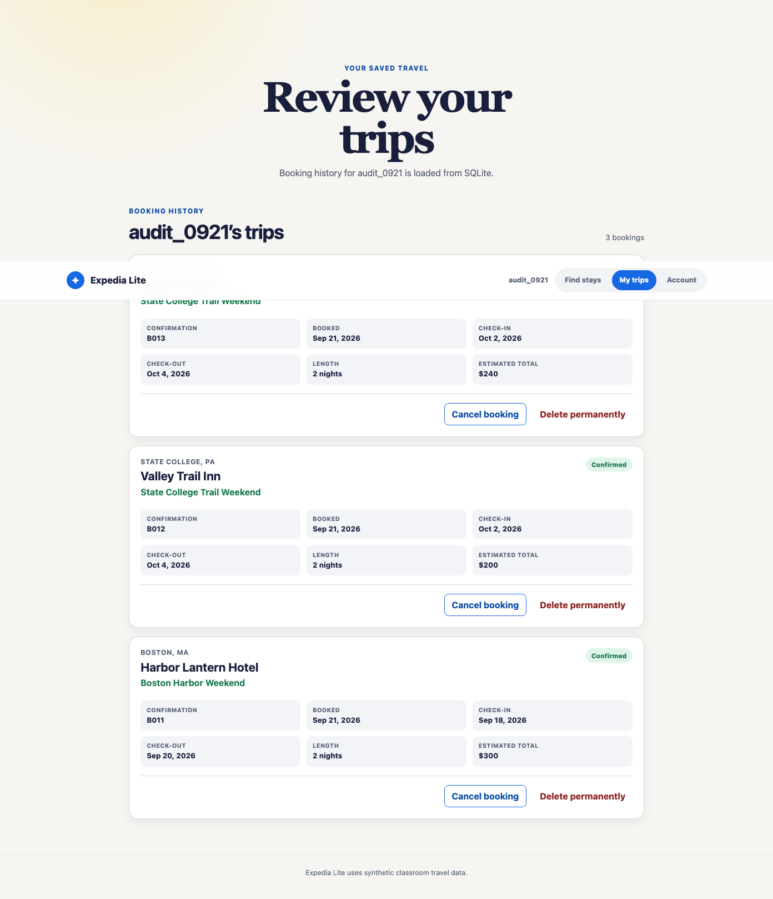
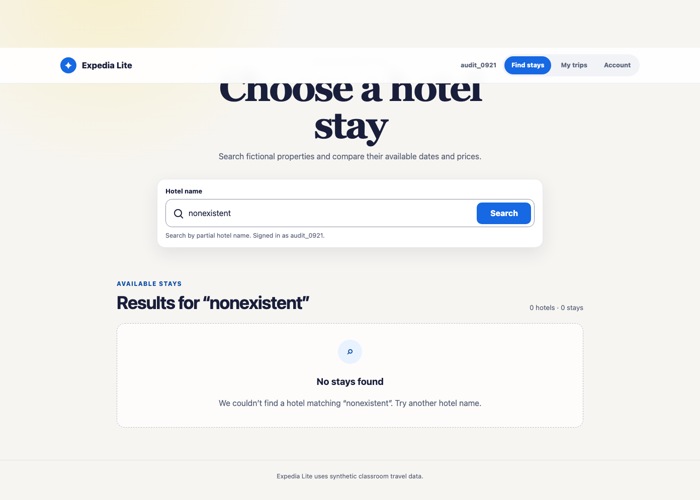

# Expedia Lite — Part 2

## Repository and commit

Repository: [https://github.com/jclee2044/expedia-lite](https://github.com/jclee2044/expedia-lite)

- Preserved Part 1 checkpoint: `a67b2e1fe9c699ad0dddfd0441ac429520b4616f`
- Final Part 2 checkpoint: record the submitted commit ID after the final commit and push.

## Implementation

Part 1 established the Vue search interface and CSV-backed hotel and stay data. Part 2 retains that search experience and adds account creation and login, simulated booking, persistent booking history, cancellation, and guarded permanent deletion.

The application follows Model–View–Controller boundaries. The Vue frontend is the View and calls documented FastAPI endpoints. FastAPI routes handle HTTP validation and delegate behavior to framework-free Controllers. Controllers apply search, pricing, account, booking, and database rules using Python Models and SQLite. The supplied CSV files seed SQLite only when the database is first created; later searches and CRUD operations use the persistent database.

Booking prices are calculated by the backend from the signed-in user's search history. A booking snapshots the effective nightly rate shown for that search, so its confirmation and history total remain consistent even if later searches change the current offer.

```text
Vue View -> FastAPI route -> Controller -> Models/SQLite
```

## Verification

All walkthrough data below used the synthetic account `audit_0921`.

### Search and effective pricing

- Action: Search for `Valley Trail` four times while signed in.
- Expected: Searches one through three show $100 per night; the fourth shows the non-compounding adjusted price of $120 per night and $240 for two nights.
- Observed: The fourth search displayed one hotel and one stay at $120 per night and $240 total.



### Create and read a booking

- Action: Book the displayed Valley Trail stay and open `My trips`.
- Expected: The confirmation and history show a unique server-issued ID, confirmed status, traveler, hotel, stay, dates, booking date, and the same $240 total displayed during search.
- Observed: Booking B015 was created as confirmed at $120 per night and $240 total, then appeared in the signed-in traveler's history with matching details.





### Update and delete a booking

- Action: Cancel B015, then use the guarded permanent-delete control.
- Expected: Cancellation retains the record with `cancelled` status. Permanent deletion requires explicit confirmation and then removes only that test booking.
- Observed: B015 remained in history after cancellation. After explicit deletion, the account's displayed history count changed from four to three and B015 was absent.





### Empty and error states

- Action: Search for `nonexistent`.
- Expected: No cards appear and the page gives a clear no-results message.
- Observed: The page reported zero matching hotels and suggested a different search.



The browser walkthrough also verified blank-search feedback, the sign-in requirement for booking, refresh persistence, cancellation, guarded deletion, responsive card layout, and an error-free browser console. Restarting FastAPI cleared the process-local session as designed, while SQLite booking data remained available after signing in again.

Automated verification passed on 2026-09-21:

- 85 backend tests
- 10 frontend API-contract tests
- frontend lint
- frontend production build (20 transformed modules)

## Project context and next steps

Project context and contracts are maintained in the [README](README.md), [project rules](AGENTS.md), [design pipeline](docs/design-pipeline.md), [MVC contracts](docs/mvc-contracts.md), [persistence contract](docs/backend-persistence-contract.md), [verification guide](docs/verification.md), and [selected prompts](prompts/setup-prompts.md).

Before submission, complete the student-only checks that cannot be represented by automated application tests: use VS Code Search to review changed files and prepare the required under-three-minute demo video. After the final Git checkpoint is pushed, replace the pending Part 2 checkpoint line above with the submitted commit ID if the course submission format requires it.

Hotel photos are decorative remote images; meaningful hotel, stay, price, and booking information remains readable if a remote image is unavailable.
