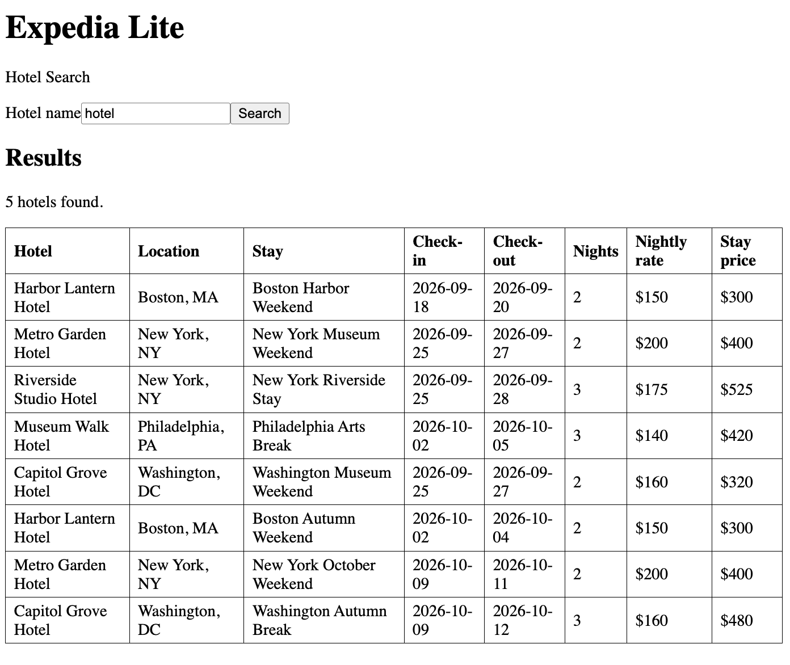
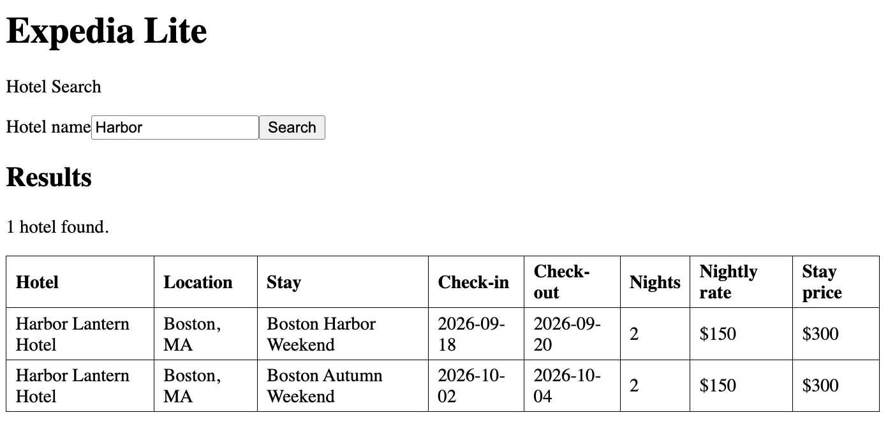
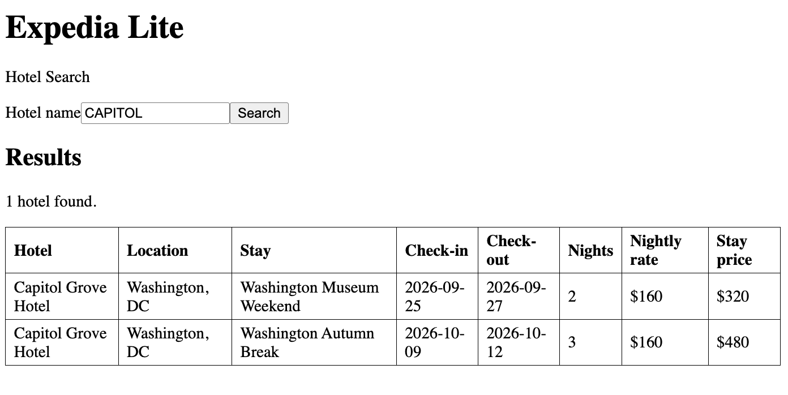
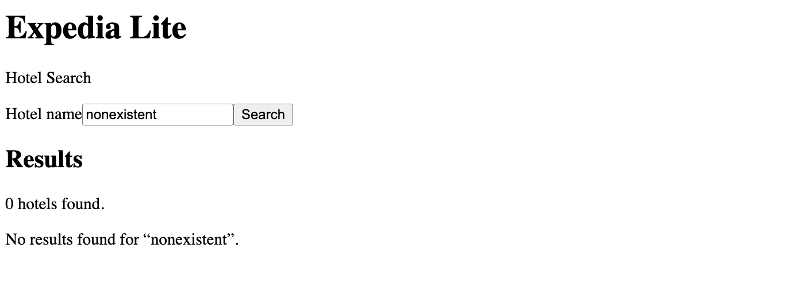

# Expedia Lite — Assignment 1

## Repository and commit

GitHub repository URL: [https://github.com/jclee2044/expedia-lite](https://github.com/jclee2044/expedia-lite)

Commit ID: `a67b2e1fe9c699ad0dddfd0441ac429520b4616f`

## Implementation

The application follows Model–View–Controller boundaries. The Vue frontend is the View: it owns search, traveler selection, booking confirmation, history, cancellation, deletion, layout, components, and CSS. FastAPI routes are thin HTTP adapters that validate the JSON contract and call Controllers. Framework-free Models define Hotel, Trip, User, Booking, joined display records, and SQLite relationships. Controllers own database connections, seed import, reference checks, hotel search, user history, and transactional booking CRUD.

The supplied CSV files seed SQLite once. After initialization, searches and booking operations use the persistent database. `Trip.hotel_id` connects trips to hotels; `Booking.user_id` and `Booking.trip_id` connect each booking to an existing user and trip. Controller contracts and the complete dependency flow are recorded in [`docs/mvc-contracts.md`](docs/mvc-contracts.md).

```text
Vue View -> FastAPI route -> Booking/Search/User Controller
                            -> Database Controller -> Models/SQLite
```

## Verification

When "hotel" is entered:

- Expected result: Each of the hotels appear.
- Observed result: Each of the hotels appear.



When "Harbor" or "harbor" is entered:

- Expected result: Only the Harbor Lantern Hotel appears.
- Observed result: Only the Harbor Lantern Hotel appears.



When "CAPITOL" is entered:

- Expected result: Only the Capitol Grove Hotel appears.
- Observed result: Only the Capitol Grove Hotel appears.



When "nonexistent" is entered:

- Expected result: No results are returned, and a clear message is shown that no results match.
- Observed result: No results are returned, and a clear message is shown that no results match.



## MVC booking operation

The Book button is displayed by `frontend/src/components/StayCard.vue` and handled by `frontend/src/App.vue`. The View calls the booking API module, which sends `user_id` and `trip_id` to the FastAPI route. The booking controller checks both references, obtains an ID from the database controller, and saves a confirmed Booking in one transaction. The returned joined record is displayed by `BookingConfirmation.vue`. An invalid reference returns an error and the transaction creates no record.

## Project context

Project context is maintained in the [README](README.md), [project-specific agent instructions](AGENTS.md), [design note](docs/design-pipeline.md), [MVC contracts](docs/mvc-contracts.md), [selected prompts](prompts/setup-prompts.md), and [current handoff](handoffs/current.md). Hotel search, booking creation, confirmation, persistent history, cancellation, and guarded deletion are implemented through the documented MVC boundaries.
