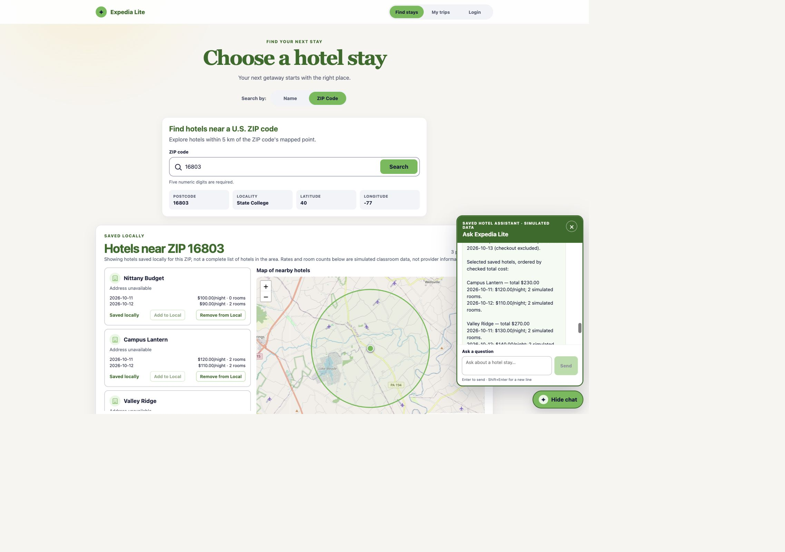
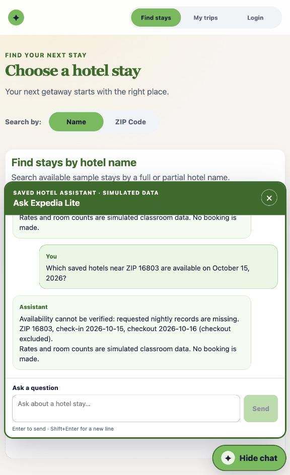
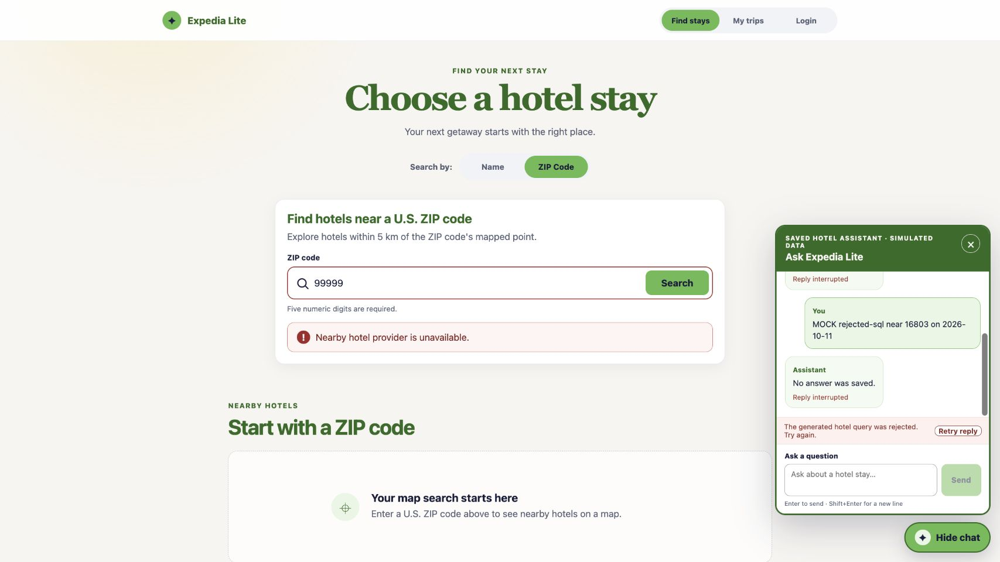

# Expedia Lite — Assignment 2, Part 2

## Scope and project access

Assignment 2.2 adds **question → LLM-proposed SQL → validated read-only local
retrieval → second LLM request with the original question and retrieved
records → grounded, actionable answer in Vue**. The local-storage foundation
is working, and the frozen Part 1 name/ZIP/list/map behavior remains covered
by regression and browser checks. The [revised brief](docs/assignment2-part2-revised.md)
and [supplied tutorial](docs/assignment2-part2-instructor-chatbot-notes.txt)
define the scope. SQLite is sufficient; no vector database was added.

Repository: [Expedia Lite](https://github.com/jclee2044/expedia-lite), branch
`rag_integration`. **Assessed application commit:
[`23b9dc2`](https://github.com/jclee2044/expedia-lite/commit/23b9dc21f7008a47538a3835cb09ea031e8c2746).**
This verified implementation checkpoint is pushed to the public repository.
The report and handoff are saved in its subsequent documentation commit.

Use Python 3.12 and the Node.js version documented in [README.md](README.md).
Create the project-owned environments with:

```bash
python3.12 -m venv backend/.venv
backend/.venv/bin/python -m pip install -r backend/requirements.txt
cd frontend
npm ci
```

Configure `GEOAPIFY_API_KEY` and `GEMINI_API_KEY` in the ignored root
`.env`; restart the backend after changing configuration. Keys and model
requests stay on the backend. The normal commands are
`backend/.venv/bin/python -m uvicorn backend.app.main:app --reload` from the
root and `npm run dev` from `frontend/`, with the UI on port 5173.
For the reproducible synthetic fixture on isolated ports 8001/5174, follow
the [recording guide](docs/assignment2-part2-demo.md). Its preparation command
refuses to overwrite an existing database. It preserves the default runtime
database and the course CSVs.

## Research and early mockup

The [early Assignment 2.2 mockup](docs/mockups/a2.2-mockups.png) and
[preflight](docs/assignment2-part2-preflight.md) preceded the chat source
changes. The [student's chat sketch](docs/mockups/a2.2-mockups.png) shows the
Chat launcher and bordered popup. The popup uses the existing green palette,
allows the page behind it to remain interactive, and supports keyboard
open/close and sending. The [W3C dialog guidance](https://www.w3.org/WAI/ARIA/apg/patterns/dialog-modal/)
informed the non-modal behavior. [MDN's log role reference](https://developer.mozilla.org/en-US/docs/Web/Accessibility/ARIA/Reference/Roles/log_role)
informed the sequential conversation region.

Google's [generate-content API](https://ai.google.dev/api/generate-content)
informed the backend provider calls. Its [structured-output guide](https://ai.google.dev/gemini-api/docs/structured-output)
informed the second request's JSON schema. The implementation uses the
existing project-owned `httpx` dependency rather than adding a provider SDK.
SQLite's [authorizer documentation](https://www.sqlite.org/c3ref/set_authorizer.html)
informed the table/function allowlist for proposed SQL. Independent backend
queries verify ZIP membership, nightly coverage, rooms, and integer-cent
totals; the LLM receives no database connection.


The [supporting popup layout sketch](docs/assignment2-part2-chat-mockup.svg)
records the additional chat states.

## Local-storage foundation and architecture

Add to Local preserves the provider `place_id` as `saved_hotels.hotel_id`,
stores the searched ZIP and center in `saved_hotel_zips`, and creates dated
simulated rows in `demo_hotel_nights`. Duplicate saves preserve existing
hotel fields and edited nights and can add another ZIP association. Remove
from Local deletes the hotel, ZIP associations, and nights transactionally.
The ZIP view checks saved records first, with a **Saved locally** label, and
calls Geoapify only after a successful empty local lookup. SQLite retains
saved hotels and conversation history across restarts.

The default simulated nights are October 10–14, 2026, at 10000 cents with
20 rooms. Geoapify supplies identities and locations, not these rates or
vacancies. The fixed demonstration data overrides those defaults and is
explicitly labeled synthetic. The original hotel/trip/account/booking tables
remain separate. No course CSV or Part 1 provider/map controller was changed
for the readiness repair.

The dependency direction is Vue View → FastAPI routes → framework-free
Controllers → Models/SQLite. Routes handle HTTP and validation; controllers
own retrieval, provider calls, transactions and persistence. Request helpers
remain separate from Vue presentation. Schema version 7 adds conversation,
message and retrieval-stage tables through an additive migration.

## Implemented two-call workflow

The first request sends the question, trusted ZIP/dates, relevant schema and
query rules to **Gemini 3.5 Flash-Lite** (`gemini-3.5-flash-lite`).
The model proposes one parameterized SELECT returning candidate hotel IDs.
The backend requires exact ZIP/date bindings, approved saved-hotel tables,
one statement, and a bounded query. A separate SQLite `mode=ro` connection,
`query_only`, authorizer, 50-candidate cap and execution budget enforce
read-only retrieval. Trusted SQL then checks each requested night, positive
rooms and total cents; checkout is excluded. Missing nightly rows mean
unknown availability. A separate saved-ZIP count prevents an empty filtered
candidate set from being described as no saved hotels.

The second request contains the **original question** and at most ten
checked stays, dated nightly records and exclusion counts. Prompt version
**5** requires only selected hotel IDs and a supported reason in JSON.
The backend requires normal provider completion and validates this
recommendation. It renders all factual text from checked records, saves
the answer and model selection together, and sends the checked text to Vue
in chunks. Unsupported IDs, extra prose fields and incomplete output produce
an error without a successful assistant message. This still uses the second
LLM call to choose a recommendation based on retrieved facts.

The [prompt](prompts/hotel-assistant.md), [retrieval controller](backend/controllers/retrieval.py),
[grounding controller](backend/controllers/grounded_answer.py) and
[orchestrator](backend/controllers/rag_chat.py) implement this contract.
SQLite stores question, proposal, attempted execution, checked result,
second-model selection, answer validation, answer, errors and timestamps.
The [read-only trace CLI](backend/inspect_rag_demo.py) makes these stages
reviewable in a recording. The frontend stores only an opaque conversation
ID. Edit question, Retry reply, Enter, Shift+Enter and Escape are implemented.

## Traced live demonstration — October 8, 2026

**Evidence: actual live Gemini calls through the normal application, over
the fixed synthetic SQLite fixture.** The failure harness was not used for
these calls. The final browser question, after restarting both task-owned
servers, was:

> Compare saved hotels near ZIP 16803 from 2026-10-11 to 2026-10-13 by total cost.

Turn ID: `f2afaf26-5a1e-4a1c-870e-252b37e6b39c`. Prompt version: 5.
The saved SQL proposal was:

```sql
SELECT DISTINCT h.hotel_id AS hotel_id
FROM saved_hotels AS h
JOIN saved_hotel_zips AS z ON z.hotel_id = h.hotel_id
LEFT JOIN demo_hotel_nights AS n ON n.hotel_id = h.hotel_id
  AND n.stay_date >= :check_in AND n.stay_date < :check_out
WHERE z.postcode = :postcode
```

```json
{"postcode":"16803","check_in":"2026-10-11","check_out":"2026-10-13"}
```

The two joins connect saved hotel identities to ZIP associations and dated
nights. The proposed query retrieves candidates; trusted backend SQL checks
the source facts below.

| Hotel / ID | October 11 cents / rooms | October 12 cents / rooms | Checked result |
| --- | --- | --- | --- |
| Nittany Budget / `fixture:budget` | 10000 / 0 | 9000 / 2 | Excluded: one requested night has zero rooms |
| Campus Lantern / `fixture:campus` | 12000 / 2 | 11000 / 2 | Match: 23000 cents |
| Valley Ridge / `fixture:valley` | 13000 / 2 | 14000 / 2 | Match: 27000 cents |

The second live model request returned:

```json
{"hotel_ids":["fixture:campus","fixture:valley"],"reason":"lowest_total_cost"}
```

**Expected:** Campus $230, Valley $270, October 11 and 12 nightly rows,
checkout October 13 excluded, Budget omitted, simulated-data label.
**Observed:** the displayed answer showed exactly those facts and identified
Campus as the lowest checked total. In particular, Valley's $140 nightly
rate was attached to **October 12**, not October 14.



The [complete saved trace](docs/assignment2-part2-stage6-trace.txt) includes
the original question, proposed SQL, records, second-model JSON and displayed
answer. It was independently read from the ignored
`backend/db/part2-oct8-audit.sqlite3` database. [rag-context.md](docs/rag-context.md)
also retains the October 6 checkpoints as historical evidence.

## Expected-versus-observed verification

All rows below were exercised during the October 8 readiness work.
Live Gemini used synthetic saved hotels; Geoapify used actual place data.
Deliberate failure cases used the explicitly labeled mock harness or
temporary databases.

| Case / evidence type | Expected | Observed |
| --- | --- | --- |
| Two-night comparison / live Gemini | Correct dated rates and totals; zero-room exclusion | Campus $230, Valley $270; all October 11–12 rows agreed with SQLite |
| Under $50 on October 11 / live Gemini | No qualifying recommendation without claiming no saved hotels | Empty model selection; correct no-match explanation; `saved_hotel_count=3` |
| October 15 / live Gemini | Missing nightly records imply unknown availability | Three candidates, three incomplete, no matches; availability cannot be verified |
| ZIP 16804 / live Gemini | No invented hotels | Saved count and candidates zero; no hotel saved explanation |
| Narrowed under-$50 SQL / MOCK filtered | Zero candidates can coexist with saved hotels | Candidate count 0, saved count 3; correct no-match answer |
| Add/duplicate/remove / browser + local API | Persist hotel and five default nights; duplicate unchanged; remove cascades | Scholar saved from 21 Geoapify places; duplicate left one identical saved row; Remove deleted its ZIP and nights |
| Restart both servers and reload / browser | Saved hotel and chat history persist; ZIP lookup uses local rows | Same saved Scholar and messages restored; saved ZIP lookup needed no provider call |
| Map/list + keyboard / browser | Selection stays synchronized | Scholar card selected pin; Enter on Nittany marker selected its card; Escape restored chat launcher focus |
| Missing context / browser | Editable error and no successful assistant message | Edit question restored draft; Shift+Enter added newline; Enter submitted |
| Rejected UPDATE / MOCK and tests | No hotel mutation or successful answer | Safe rejection; fixture rows/counts preserved, no assistant message or retrieval result |
| Quota / MOCK rate-limit | Useful retry error without fabricated answer | Safe rate-limit message and Retry control |
| Unsupported answer / MOCK bad-answer | Reject invented prose, including wrong date | No successful assistant or unchecked delta; Retry failed safely while mock remained invalid |
| Part 1 / browser | Harbor one hotel/two stays; blank/no-results states | All three observed; ZIP 16802 returned 21 places at a 5 km radius |
| ZIP error states / MOCK | Preserve 00501; distinguish empty/unresolved/provider error | All displayed the expected distinct state |
| Narrow popup / browser | Composer and panel fit without horizontal overflow | Measured 520px viewport, page width 520px; panel/composer inside bounds |
| Regression | Existing and new checks pass | 164 backend, 26 frontend; Oxlint, ESLint and production build passed |
| Browser logs and database integrity | No application errors or broken references | Both browser warning/error logs empty; all inspected databases had zero foreign-key violations |




### Rejected SQL proof

**Evidence label: deliberately mocked proposal and synthetic temporary
database; no live model was asked to issue a destructive query.**
The browser harness proposed `UPDATE saved_hotels SET name=:postcode`.
The controller rejected it before retrieval, recorded an error, and showed
no assistant answer. Regression tests also reject multiple statements,
unapproved tables, schema reads and SQL functions, checking unchanged
saved-hotel/ZIP/night rows. Application-owned history/error writes are
separate from model-proposed read-only retrieval.



The [readiness record](docs/assignment2-part2-stage6.md) documents fixes,
commands, observed cases and limitations. The [command transcript](docs/assignment2-part2-stage6-commands.txt)
lists each shell command. The bounded AutoLoop passed the focused repair
suite, then the full regression checks; no dependency change was needed.
Two pre-existing dependency deprecation warnings remain.

## AI disclosure, limitations and recording

For the October 8 critical review, repairs, tests, browser interaction and
documentation, I used **Codex with GPT-6.1 Sol**, confirmed from this chat's
model selector. The runtime chatbot uses **Gemini 3.5 Flash-Lite**
(`gemini-3.5-flash-lite`) for both model requests. Earlier Part 2 work was
recorded as Codex/GPT-6; the exact earlier selector name is not independently
confirmed here. The earlier Part 1 disclosure below identifies GPT-6 Sol.

The user directed “critically review the current implementation” and
“please plan and resolve those gaps step by step.” These prompts led to
independent saved-ZIP counting, the structured recommendation contract,
[grounding regression tests](backend/tests/test_grounded_answer.py), browser
failure scenarios, and the updated evidence. Earlier prompts included
“plan + execute turn 3,” “autoloop after each run. automated browser testing,”
and “continue to turn 4,” leading to guarded retrieval and durable chat.

A failed approach was accepting free-form second-model prose. A live review
found correct two-night totals with an incorrect nightly date. Another
controlled filtered query plus a live second request incorrectly described
zero candidates as no saved hotels. Version 5 replaces that prose with a
validated selection and database-rendered facts, and separately counts saved
hotels. Tests inject the wrong-date prose and filtered-empty case; the final
live and browser checks above verify the corrected behavior. Historical
October 6 fixes also included an ESLint `process` import and replacing a
failed-reply placeholder with an honest error/Edit state.

Limits: these rates and rooms are simulated and cannot be booked. The parser
accepts one five-digit ZIP and one or two ISO/full-month dates, with explicit
same-context follow-ups; other forms may need clarification. Up to 50 SQL
candidates and ten checked stays are considered for the second request.
The model still interprets natural-language preferences within this bounded
contract. No exhaustive hotel inventory, every provider failure, full browser
process restart, or instructor access to a future recording was established.

**Part 2 video: TODO — record the sequence in the
[recording guide](docs/assignment2-part2-demo.md), add a link viewable by the
instructor without requesting access, review this report, and upload it.**
The earlier Part 1 video below does not satisfy the Part 2 requirement.
The recording must show question, proposal, records, second-model selection,
displayed answer, expected-versus-observed checks, no-match/missing data,
rejected SQL, and persistence. Screenshots and a recording plan do not
establish that this video exists.

## Earlier Part 1 research notes and evidence

I looked at [Trivago](https://www.trivago.com/), [Expedia](https://www.expedia.com/Hotels), and [Booking.com](https://www.booking.com/). My [Trivago screenshot](docs/mockups/assignment-1/trivago.png) shows the idea I liked most: hotel cards on the left and a map on the right. I also liked seeing a picture next to each hotel name.

The Trivago screen felt clunky and overcrowded to me. Not all the hotel names appeared on screen, and the prices on the map jumped up and down, which was distracting and confusing. I kept the cards-left/map-right idea but made the cards simpler and easier to read.

I also consulted the [Geoapify geocoding](https://apidocs.geoapify.com/docs/geocoding/) and [Places](https://apidocs.geoapify.com/docs/places/) documentation and the [Leaflet quick start](https://leafletjs.com/examples/quick-start/) while building the ZIP search and map.

## Early mockup


The [mockup](docs/mockups/a2.1-mockups.png) was drawn before implementation. It shows hotel cards on the left and pins on the right, with a name callout. The final interface adds ZIP search and linked selection. I tried an indigo color, did not like it, then liked the [green preview](docs/mockups/assignment-1/green-brand-preview.jpg) and used green instead. A separate [layout sketch](docs/assignment2-part1-mockup.svg) was drawn during implementation.

I also tried putting a picture on the left side of each card, like the Trivago example. Most Geoapify results did not have an image, so I dropped that idea rather than showing an ugly placeholder icon.

## Earlier Part 1 screen-recorded demo video

[Expedia Lite A2.1 Demo.mov](<Expedia Lite A2.1 Demo.mov>)
You can also access it [here](https://drive.google.com/file/d/1APcj5KUJjuMnFSSOqp4xS9IsRatzvbxZ/view?usp=drive_link).

## Earlier Part 1 verification record

On September 29, 2026, the automated checks passed: **118 backend tests** and **16 frontend tests**. The live ZIP searches below were observed on September 29, 2026.

Test 1: When the user searches ZIP `16802`:

- Expected: The app shows hotel results near State College, PA, in the list and on the map.
- Actual: The app resolved `16802` to State College and displayed 21 places, including the Nittany Lion Inn and the Penn Stater, with matching map markers.

Test 2: When the user searches ZIP `17042`:

- Expected: The app shows hotel results in the Lebanon, PA, area.
- Actual: The app resolved `17042` to North Cornwall Township and displayed two places: Days Inn - Lebanon / Hershey in Lebanon and Fairfield Inn & Suites in North Cornwall Township.

Test 3: When the user clicks the hotel card for the Nittany Lion Inn:

- Expected: Its associated map marker is highlighted.
- Actual: The card and its matching marker both showed the selected state after the card was clicked.

Test 4: When the user clicks the map marker for the Penn Stater:

- Expected: The associated hotel card is selected.
- Actual: Activating the marker with the keyboard selected and scrolled to the Penn Stater card.

Test 5: When the user submits ZIP `000000`:

- Expected: The app shows an error about the ZIP code instead of running a hotel search.
- Actual: The app showed “Enter exactly five digits for a U.S. ZIP code.” No hotel results appeared.

Test 6: When the user enters letters such as `abcde` for the ZIP code and submits the form:

- Expected: The interface does not accept letters as a valid ZIP code.
- Actual: The form rejects letters on submission with “Enter exactly five digits for a U.S. ZIP code.”

## AI disclosure and evidence log

I used **Codex with GPT-6 Sol** for the implementation, visual previews, and verification. These prompt excerpts show how I directed the work.

The setup prompt led to the [Geoapify controller](backend/controllers/places.py) and [ZIP request code](frontend/src/api/locations.js):

```vbnet
identify key dependencies and initial setup for PART 1 of assignment 2. Must be able to look up by zip code and find hotels in that area.
develop a step by step plan to get the dependencies setup, following best swe principles and finding the minimal solution.
```

The selection prompt shaped the [list](frontend/src/components/NearbyHotelsPanel.vue) and [map](frontend/src/components/NearbyHotelsMap.vue):

```vbnet
currently clicking a hotel on the left side selects the pin on the right. next step, we need the opposite to be true as well. clicking the pin on the right should select the hotel on the left
```

The hover prompt added the name callout in the [map component](frontend/src/components/NearbyHotelsMap.vue):

```css
on the map, when i hover over a pin, it should have a callout directly above the pin showing the name of the hotel
```

I annotated the left side of the card and asked for pictures, then revised that approach when most results had no image. The [cards](frontend/src/components/NearbyHotelsPanel.vue) no longer depend on hotel pictures:

```sql
add the pull for the hotel image and display it on the left side of the card, with text on the right, for each card.
implement only the backend first. once thats been validated then add the frontend
```

This indigo prompt changed [main.css](frontend/src/assets/main.css). I disliked the result, previewed green, and chose green instead:

```css
this is now the brand color of the app. change the main headings (e.g., "Choose a hotel stay", "Hotels near ZIP #####", etc), icon, pill background colors
background of the hotel icons should be a lighter version of this
```
